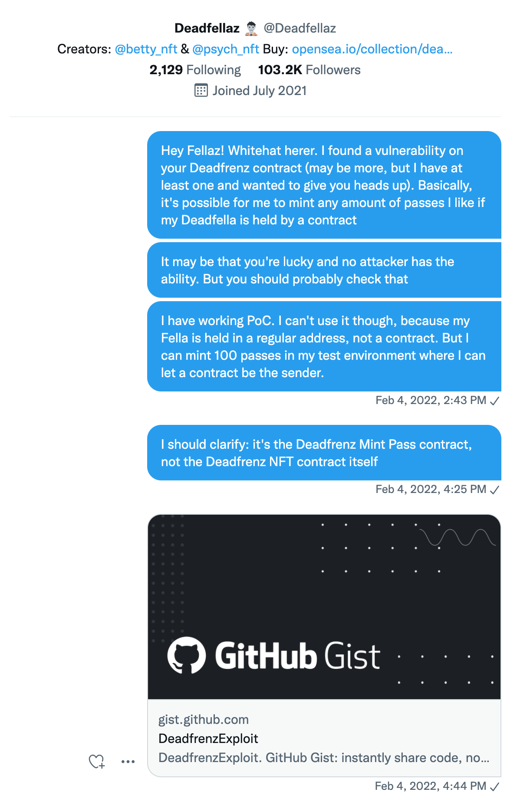

Keep calm and no one will get rekt
==================================

 

Frenz, fellaz, countrymen,

I'm hjort.eth.
I am my fella and my fella is me.
(At least on Twitter).
I'm also an auditor.
That's my day job.

Usually, that means I get paid (handsomely) to look at code and find potential exploits.
It's a great experience, securing protocols, helping devs and getting thanked when I find something serious.
I also just enjoy the puzzle. 

I found two exploits on the Deadfrenz Lab Access Pass mint.
I tried to notify the team, but got little response back.
Both exploits had to do with minting, so they are no longer exploitable.
Here is what I found, and what happened, and what I think of it.

**Note 1**: I made a proof-of-concept attack for each of the bugs, both work well.
If you're curious you can check them out here: [[https://github.com/hjorthjort/DeadfrenzAttack]].

**Note 2**: The team did disclose an issue early on for which they paused the contract, but that is a different issue from the ones I bring up here.


I do know that the reentrancy issue (the most severe one) was never exploited, but I can't say if that's luck or if the team did the mitigation I suggested.
Either way I never got a proper response.

## Checking the code, finding the bugs

I was as happy as anyone to hear about the Deadfrenz launch.
And since I know a thing or two about Solidity, I wanted to check out the contract before I claimed my pass.
Never hurts to check.

What I did find were two security holes.
One was less severe, and meant that, had people realized it, the pass sale would have lost some revenue.
One was extremely severe, but I didn't know if it was exploitable.

## The first attack: kinda bad

The first attack meant you could mint for cheaper than you should.
In short, anyone who was allowed to mint a few different types of paid passes (0.1 ETH or 0.15 ETH each) would not have to pay full price.
The core issue is that the contract was checking `msg.value` (how many ETH you sent along) inside a `for` loop, which is an anti-pattern.

At most, someone could mint their passes for 1/3rd of the price.
This would be bad for the team, as it would mean losses in revenue.

But even if some users knew, they would each be able to cheat the protocol/team out of at most a few ETH.
There would be no real loss to users, and the attack does not really scale well.
I made a proof of concept attack and concluded it was possible, and I told the team.
There wasn't really much to do about it, except maybe telling people and let them know that they got a discount.
It's always a good idea to disclose, if nothing else to let users and whitehats like myself know that it's a known issue.

## The second attack: very bad

The second attack put user funds (passes) at serious risk, and was infinitely scalable.
If it had been attacked, all your passes could have become worthless and we would need to roll back the whole mint and redo.
Some of you could have bought worthless passes on OpenSea or LooksRare, for real ETH, and be stuck rekt.

Here's how it works.
Below is the vulnerable function.
`claim` is what you call when you as, for example, a DeadFellaz holder would try to claim a mint pass.
`numPasses` is the amount of passes you want to mint right now, `amount` the total amount of passes you are allowed to mint, `mpIndex` defines the type, and the `merkleProof` is a method for showing you are actually whitelisted.

```solidity
    function claim(
        uint256 numPasses,
        uint256 amount,
        uint256 mpIndex,
        bytes32[] calldata merkleProof
    ) external payable {
        // verify call is valid
        
        require(isValidClaim(numPasses,amount,mpIndex,merkleProof));
        
        //return any excess funds to sender if overpaid
        uint256 excessPayment = msg.value.sub(numPasses.mul(mintPasses[mpIndex].mintPrice));
        if (excessPayment > 0) {
            (bool returnExcessStatus, ) = _msgSender().call{value: excessPayment}("");
            require(returnExcessStatus, "Error returning excess payment");
        }
        
        mintPasses[mpIndex].claimedMPs[msg.sender] = mintPasses[mpIndex].claimedMPs[msg.sender].add(numPasses);
        
        _mint(msg.sender, mpIndex, numPasses, "");

        emit Claimed(mpIndex, msg.sender, numPasses);
    }
```

The issue is the `if`-branch.
It makes some sense that you would want to send any extra ETH back (though just checking that the amount sent is exactly right is usually better).
But what makes this very dangerous is the send happens before any update to the mint contract.
That's why we always say "checks, effects, interactions".


[It's not the first time I've had to say this, and not the last](https://twitter.com/rikardhjort/status/1489671383160442884).

It means: Don't interact with an external address until you have updated your local variables.
Specifically, the number of minted passes has not been updated yet.
This bug could thus have been averted if you just put the `if`-clause at the end of the function.

This is a typical reentrancy bug.
An attacker can easily set up a contract with a fallback function and send 1 wei more than necessary when calling `claim`.
That will cause this function to call back to the sender, triggering the fallback function, which can then call the `claim` again, and succeed because the contract has not yet registered the previous claim.

This way, the attacker can mint as many passes as they like, they can even mint more than the max total ceiling on the tokens, because at every call the contract thinks it's performing the first mint.

That would be very, very bad.

But I couldn't, and that is what makes this exploit so different, and also why I didn't disclose it why the mint was ongoing.

## Why didn't I exploit this?

First of all -- I would have if I could, but as a whitehat.

Normally, as a whitehat, if I found this and didn't get a timely response from the team I would just perform the attack myself.
That's better than having such an exploit sit out in the open, waiting for a blackhat hacker to steal all the tokens and sell them for market price on OpenSea, making of with a bunch of ETH.
I would have minted all the tokens in the pool I could exploit, then chat with the devs and figure out how to make sure they get properly distributed.
100% doable, not even very expensive (except for me, I have to pay a lot of gas).

But I couldn't.
Because this is a reentrancy attack, only a contract can execute it.
I was holding my Deadfella in a regular externally owned address (EOA).
Because the mint was using a Merkle proof, and it included the `msg.sender` in the node, there's no way I or anyone else can make the call from any address not included in the snapshot.
That also means that even if you held your eligible NFT in a contract at the time of the snapshot, you might not be able to perform the reentrancy attack, unless your contract was very flexible and could implement the attack.

## So what's the problem?

The problem is that someone could probably exploit this.
There are contracts which are upgradable, or support executing any code, including the necessary code to do the attack.
In fact, it's a common feature of contract wallets, such as Gnosis Safe.
The main question I was worried about when I reached out to the team was: are there any contract addresses included in the snapshot, and which are they?

I later found at least one verified DF holder in the Discord asking if it would be possible to claim from his Gnosis Safe.


The mod here is saying that the holder can't claim from his smart contract wallet.
That could mean one of two things.
Either, they have written some kind of filter that would ensure that no address which is a contract gets included in the whitelist;
or, they are not aware of how this user could perform the claim -- the UI might not support claiming, but the actual chain code is quite flexible.

If I, or the dev team, could just scan through the eligible addresses and make sure there are none in there which could perform the attack, we could exclude them from the claim by upgrading the Merkle root.
Some Merkle roots were upgraded several times during the claim period.
It is entirely possible that the team had realized the problem and patched it themselves, without announcing it.
A safe filter for accounts to exclude them would look something like this: only allow addresses that have sent out a transaction -- these can not be contracts.
(Note that even if an address has no code on it, it can still be a contract, just one that is not deployed yet.)

## What damage could have been done?

An attacker for the reentrancy could mint an arbitrary amount of mint passes.
Perhaps the most clever thing would have been to mint and immediately do a quick dump on OpenSea, making off with a few ETH (when I checked, there were 6 open bids at ~0.65 ETH per pass that could be executed directly).
They could also just hold on to some passes and sell them later.
As long as the amount was not too great, and they managed to go undetected (or ignored) by the team, they could simply be owning or dumping a bunch of extra Deadfrenz.

The reentrancy bug was never exploited.
I have checked the [contract log of internal transactions](https://etherscan.io/txsInternal?a=0x090f688f0c11a8671c47d833af3cf965c30d3c35&&m=advanced&p=200), and the earliest one is from after minting closed.
Phew, I guess.

## Notifying the team

Here's what I sent to the Deadfellaz Twitter account:



I also notified `@betty_nft` and `@psych_nft` that they should check those DMs, because I assumed they may get a lot of DMs.
I got no responses on Twitter.

I also went on Discord and tried to get in contact with a mod or anyone else who could put me in touch with the devs, or at least let me know my message had been received by someone who would be able to evaluate it.
I did get a response, but it was dismissive.


## Feedback time

So here's what the team did well:

- They did a secret snapshot + Merkle proof drop.
  That reduces attack surfaces in many cases.
  It's not something I generally suggest as a security tactic, but in practice it does cut down possible attacks by cutting down who can interact at all.
- For all I know, they may have updated the eligible minters to make sure no contracts were included.
  By the nature of how Merkle trees work, there's no way for me to know.

What do I wish could have been done differently:

- There was no clear way to report issues.
  It's always good to have some e-mail address or designated contact for these things.
- The vulnerability should be disclosed, even if it was not exploited.
  If you find an issue and patch it, you should disclose it.
  It's the responsible thing to do.
  It lets people know that you are on top of the issue.
  It also helps freindly security folks like myself.
  If I know you are aware, I don't need to wast my time writing proof-of-concepts and trying to get in touch with you.
  For now, I have to assume they were not aware, and chose to ignore it when it was reported.
- I you get a whitehat report (like the ones I sent), acknowledge it and connect the whitehat to a dev.
  If you are 100% sure that your devs are aware of the issue, then you should tell the whitehat that, and point to the mitigation (a transaction usually).
  If you are less than 100% sure, just connect us.
  We can chat for 10 minutes and possibly figure out whether all bases have been covered.
  If they haven't, we can talk mitigations.
- Say "thanks for not hacking us".
  This may sound petty, but I get pretty annoyed when I spend some free time securing your token, and don't try to exploit it (by finding a partner, in this case), and I get stonewalled.
  There are blackhat hackers as well, and in this case their efforts would probably be worth their while, so make sure to thank your whitehats.

## Keeping it to myself

I decided to sit on my hands on this one and not try to cause any more stir.

When the team failed to get back to me within a day and I had received a message saying everything was fine(!), I had to decide how to proceed.
The attack required both opportunity and knowledge, and given that an attacker could hardly have anticipated the opportunity (the snapshot + the bug) it seemed likely that no one had both.
I was in a Dark Forest-like situation.
The fact that the bug was obscure seemed to be its greates strength.
Even if I just disclosed that there is some bug, that would be enough for any reasonably sophisticated user to go and check out the contract and likely immediately locate the issue.
I still feel iffy about my decision.

I considered finding a partner in crime with whom I could whitehat.
But that would require some special trust: there would be no guarantee that the person on the other end would not just floor dump their tokens once they got them.
It seemed less responsible to even attempt.
And again, just going around looking for someone with a DF in a contract account could raise suspicion.

## Closing thoughts

I think we should consider how we deal with security issues.
NFT users get rugged and exploited all the time.
The least we can do is help each other help each other.
I'm a boring lackluster who likes to point out faults, a bit like an accountant, but honestly, you need people like that, too.

It turned out well in the end, but I would have liked a safer approach.

I checked the Deadfrenz contract directly after I realized I wouldn't be getting a response from the team.
The contract looks clean.
Good job devs!

If you want to involve me in the future before deploying a new contract, don't hesitate to ask.
